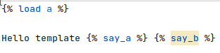

Small test case to show that PyCharm is not following the imports when resolving templates.

This is how this [PR #1024](https://github.com/django-crispy-forms/django-crispy-forms/pull/1024) in django-crispy-forms started.

See the file [test_templates/templates/test_templates/index.html](https://github.com/cpina/django_pycharm_import_templates/blob/main/test_templates/templates/test_templates/index.html):
```html


Hello template  
```

It imports `a.py` and uses `say_a` and `say_b`.

In [a.py](https://github.com/cpina/django_pycharm_import_templates/blob/main/test_templates/templatetags/a.py#L6) it does:
```python
from django import template


register = template.Library()

from .b import *


@register.simple_tag
def say_a():
    return 'a'
```

Django has no problem using `say_b` but PyCharm displays it with a warning:

